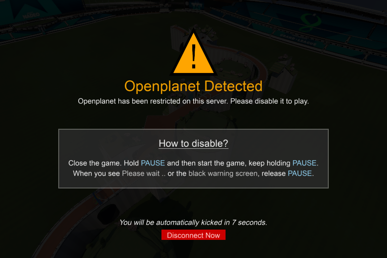
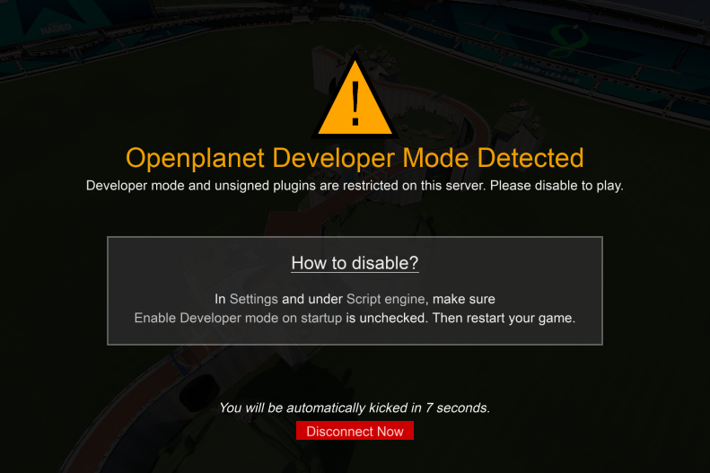

# EvoSC Openplanet Control

This module allows you to control whether a player can play on your server when they are joining with Openplanet enabled.

## Screenshots
**Normal Mode**

**Dev Mode**

## Installation

1. Download the [latest release](https://github.com/snixtho/EvoSC-OpenplanetControl/releases/latest/download/OpenplanetControl.zip).
2. Inside the ZIP file, you will find a directory called "OpenplanetControl". Extract this into `<evosc root>/modules`
3. Restart EvoSC.
4. You can configure the module in the file `<evosc root>/config/opcontrol.config.json`

## Configuration

- `enabled` | `true`/`false` | If true, the module is enabled, false is disabled.
- `devVersionOnly` | `true`/`false` | If true, the module only handles players with Openplanet developer mode enabled. Developer mode essentially means unsigned plugins can be run in Openplanet.

- `autoKick.enable` | `true`/`false` | Automatically kick players that use Openplanet.
- `autoKick.delay` | Number in seconds | How long to wait before kicking the player. 0 or lower is insta kick.

- `autoSpec.enable` | `true`/`false` | Automatically set the player into a restricted spectator mode. (They cannot go out of spectator)

- `warning.notifyAdmins` | `true`/`false` | Show chat messages when players that use Openplanet has joined the server or is kicked because of it.
- `warning.showPlayerWarning` | `true`/`false` | Display a un-closable big window in the middle of the screen telling the user that they are using Openplanet and with instructions for disabling it. (See screenshots)

- `whitelist` | List of strings | A list of player Logins that will be ignored by the module. These players will not be warned, forced spectator or kicked.

## Permission Setup
There are two permissions that can be added to groups.

- `opcontrol_manage`: Allows players to manage the module from ingame.
- `opcontrol_ignore`: Any player that is in a group with this permission will be ignored by the module.

## Commands

- `//opcontrol_enable`: Enable the module.
- `//opcontrol_disable`: Disable the module.
